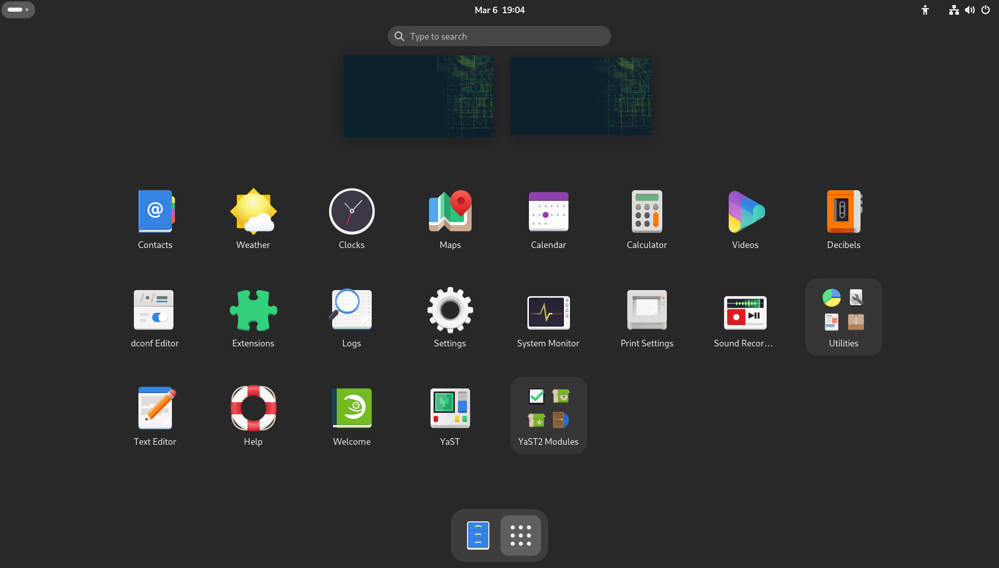
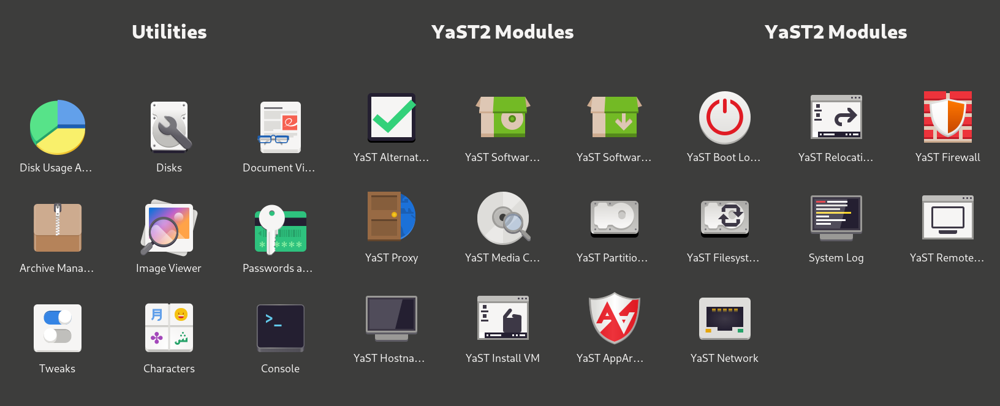

# openSUSE-scripts 🦎
This repository contains various installation and setup scripts for **openSUSE Tumbleweed**.

**Note:** All scripts must be run as **root**.

## List:
---
- **suse_modern_gnome.sh**
> This script creates a modern **GNOME** experience by replacing legacy apps with their newer counterparts. It works best on a fresh installation with online repositories enabled. You may optionally install a web browser via **Flatpak** after the first boot, for example:
> ```
> flatpak install flathub-beta org.mozilla.firefox
> ```
> Also includes [zypper-unjammed](https://github.com/makesourcenotcode/zypper-unjammed), and sets up an alias for zypper-autoremove.
>    
> 
> 
   
---
- **suse_rocm_radeon.sh**
> Performs a lightweight **ROCm** installation for **Radeon GPUs**.
---
- **suse_rusticl_radeon.sh**
> Installs and configures **Rusticl** for **Radeon GPUs**.
---
